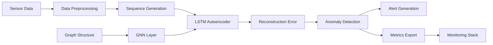
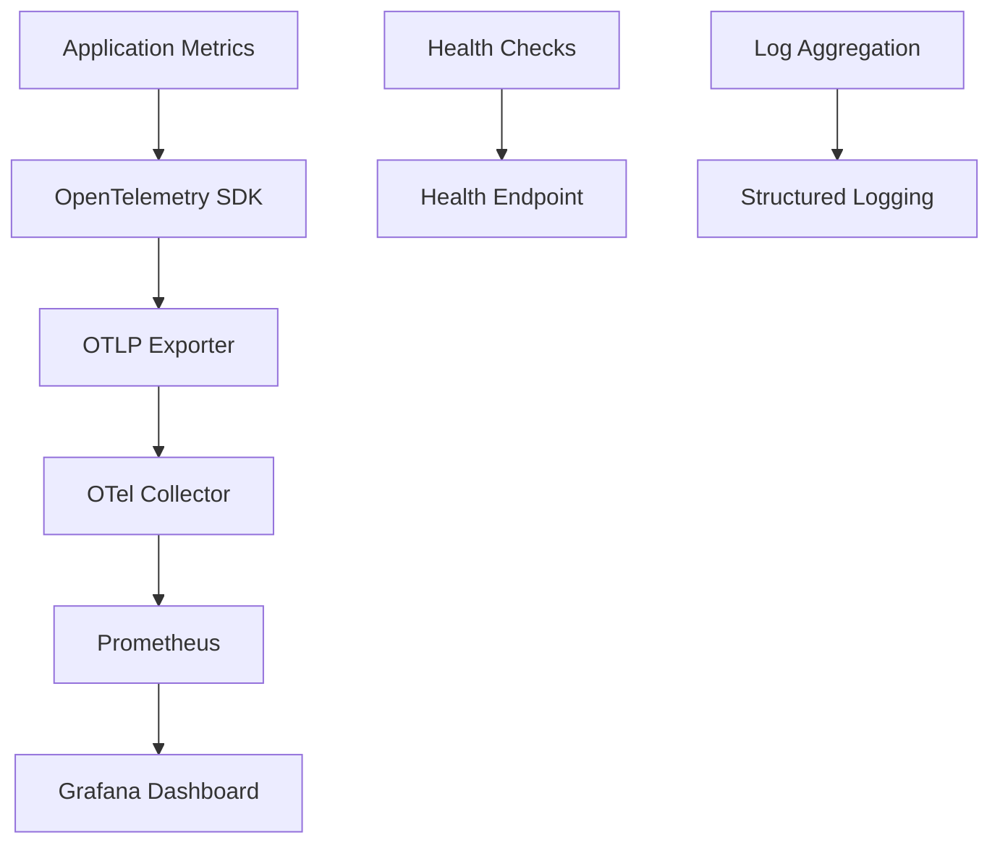
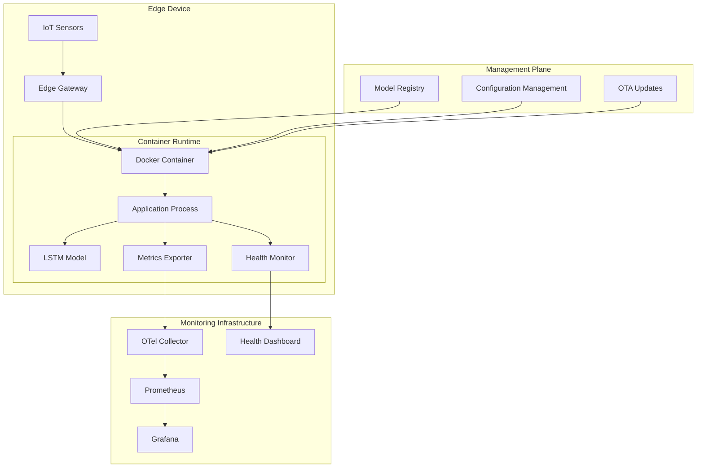

# IoT Edge Graph Anomaly Detection - Architecture

## System Overview

The IoT Edge Graph Anomaly Detection system is designed for deployment on resource-constrained edge devices to provide real-time anomaly detection for IoT sensor networks. The system combines LSTM autoencoders for temporal pattern analysis with Graph Neural Networks (GNN) for capturing spatial relationships between sensors.

## Architecture Principles

### Edge-First Design
- **Resource Constraints**: <100MB RAM, <25% CPU on Raspberry Pi 4
- **Local Processing**: All inference performed locally, no cloud dependency
- **Minimal Latency**: <10ms inference time for real-time detection
- **Offline Capable**: Fully functional without network connectivity

### Security by Design
- **Data Privacy**: No raw sensor data leaves the device
- **Secure Communications**: TLS 1.3 for all external communications
- **Container Isolation**: Sandboxed execution environment
- **Minimal Attack Surface**: Non-root execution, read-only filesystem

### Observability-Native
- **OpenTelemetry**: Standardized metrics and tracing
- **Health Monitoring**: Comprehensive system health checks
- **Performance Tracking**: Real-time inference and resource metrics
- **Alert Generation**: Anomaly detection with configurable thresholds

## System Components

### Core ML Pipeline

#### 1. Data Ingestion Layer
- **Purpose**: Collect and preprocess sensor data streams
- **Components**:
  - SWaT Dataset Loader
  - Real-time data streaming interface
  - Data validation and sanitization
- **Output**: Normalized time-series sequences

#### 2. LSTM Autoencoder
- **Purpose**: Learn temporal patterns in sensor data
- **Architecture**:
  - Encoder: Multi-layer LSTM with dropout
  - Decoder: Multi-layer LSTM for reconstruction
  - Hidden Size: 64 (configurable)
  - Sequence Length: 10 time steps
- **Training**: Reconstruction loss minimization on normal data

#### 3. Graph Neural Network (Future)
- **Purpose**: Model spatial relationships between sensors
- **Integration**: Hybrid LSTM-GNN architecture
- **Graph Structure**: Sensor topology from configuration
- **Status**: Planned for v0.2.0

#### 4. Anomaly Detection Engine
- **Method**: Reconstruction error thresholding
- **Threshold**: Adaptive or configurable
- **Output**: Binary anomaly classification + confidence score

### Monitoring & Observability

#### Metrics Collected
- **Application Metrics**:
  - Anomaly detection count
  - Inference latency (p50, p95, p99)
  - Reconstruction error distribution
  - Model accuracy metrics
  
- **System Metrics**:
  - Memory usage (RSS, heap)
  - CPU utilization
  - Disk I/O and usage
  - Network latency and throughput

- **Business Metrics**:
  - Anomaly rate trends
  - Alert response times
  - System availability
  - Model drift indicators

#### Health Monitoring
- **System Health**: Memory, CPU, disk usage
- **Model Health**: Inference performance, staleness
- **Network Health**: Connectivity, latency
- **Data Health**: Input validation, quality metrics

### Deployment Architecture

## Data Flow

### Training Data Flow
1. **Dataset Loading**: SWaT dataset or custom sensor data
2. **Preprocessing**: Normalization, sequence generation
3. **Training**: LSTM autoencoder on normal data only
4. **Validation**: Hold-out validation set for threshold tuning
5. **Model Export**: Serialized PyTorch model for deployment

### Inference Data Flow
1. **Data Ingestion**: Real-time sensor readings
2. **Preprocessing**: Same normalization as training
3. **Sequence Formation**: Sliding window approach
4. **Model Inference**: LSTM forward pass
5. **Anomaly Detection**: Reconstruction error analysis
6. **Action Execution**: Alert generation, metrics export

## Technology Stack

### Core Framework
- **Python 3.8+**: Primary development language
- **PyTorch 2.0+**: Machine learning framework
- **PyTorch Geometric**: Graph neural network support
- **NumPy/Pandas**: Data manipulation and analysis

### Edge Runtime
- **Docker**: Containerized deployment
- **Alpine Linux**: Minimal base image
- **ARM64/x86_64**: Multi-architecture support
- **Non-root User**: Security hardened execution

### Monitoring Stack
- **OpenTelemetry**: Observability framework
- **Prometheus**: Metrics storage and alerting
- **Grafana**: Visualization and dashboards
- **OTLP**: Standardized telemetry protocol

### Development Tools
- **pytest**: Testing framework
- **Black**: Code formatting
- **mypy**: Type checking
- **pre-commit**: Quality gate automation

## Security Architecture

### Threat Model
- **Assets**: ML models, sensor data, edge device resources
- **Threats**: Model extraction, data poisoning, resource exhaustion
- **Mitigations**: Access controls, input validation, resource limits

### Security Controls
- **Container Security**: Non-root user, read-only filesystem, capability dropping
- **Network Security**: TLS encryption, certificate pinning, firewall rules
- **Data Protection**: Local processing, encryption at rest, secure deletion
- **Access Control**: Role-based access, API authentication, audit logging

## Performance Characteristics

### Resource Requirements
- **Memory**: <100MB total memory footprint
- **CPU**: <25% utilization on Raspberry Pi 4
- **Storage**: <1GB for application and models
- **Network**: <1Mbps for telemetry export

### Performance Targets
- **Inference Latency**: <10ms per sample
- **Throughput**: >100 samples/second
- **Availability**: >99.9% uptime
- **Recovery Time**: <30 seconds after failure

## Scalability Considerations

### Horizontal Scaling
- **Multi-Device**: Independent deployment per edge device
- **Load Balancing**: Regional monitoring infrastructure
- **Data Aggregation**: Hierarchical anomaly correlation

### Vertical Scaling
- **Model Optimization**: Quantization, pruning, distillation
- **Resource Optimization**: Memory pooling, batch inference
- **Compute Optimization**: GPU acceleration where available

## Future Enhancements

### v0.2.0 - Graph Neural Networks
- **GNN Implementation**: Spatial relationship modeling
- **Hybrid Architecture**: LSTM-GNN integration
- **Dynamic Graphs**: Adaptive sensor topology

### v0.3.0 - Advanced Features
- **Federated Learning**: Multi-device model updates
- **Drift Detection**: Automated model retraining
- **Ensemble Methods**: Multiple model voting

### v1.0.0 - Production Hardening
- **Enterprise Security**: Advanced threat protection
- **High Availability**: Redundancy and failover
- **Regulatory Compliance**: Industry certifications

---

**Architecture Version**: 1.0  
**Last Updated**: 2025-01-27  
**Next Review**: 2025-04-27