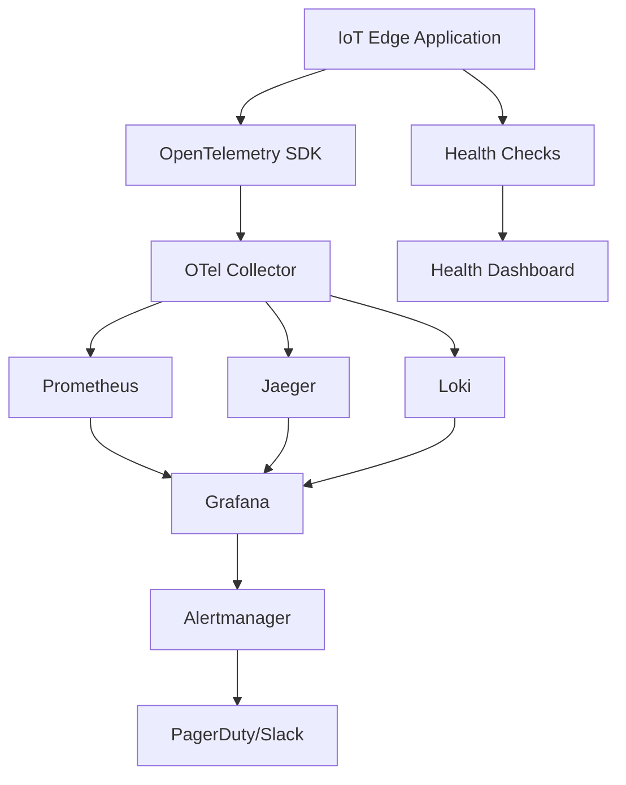

# Monitoring and Observability Guide

This document provides comprehensive guidance on monitoring and observability for the IoT Edge Graph Anomaly Detection system.

## Overview

The monitoring stack follows the **Three Pillars of Observability**:
- **Metrics**: Quantitative measurements (performance, resource usage, business metrics)
- **Logs**: Event records with context and timestamps
- **Traces**: Request flow and performance across system components

## Architecture



## Components

### 1. OpenTelemetry (OTel)
- **Purpose**: Unified observability framework
- **Configuration**: `/monitoring/otel-collector-config.yaml`
- **Protocols**: OTLP gRPC (4317), OTLP HTTP (4318)
- **Processing**: Batching, resource attribution, memory limiting

### 2. Prometheus
- **Purpose**: Metrics collection and storage
- **Configuration**: `/monitoring/prometheus.yml`
- **Retention**: 15 days (configurable)
- **Scrape Interval**: 15s global, 10s for application

### 3. Grafana
- **Purpose**: Visualization and dashboards
- **Port**: 3000
- **Default Credentials**: admin/admin123
- **Dashboards**: Pre-configured for IoT metrics

### 4. Alertmanager
- **Purpose**: Alert routing and management
- **Configuration**: `/monitoring/alert_rules.yml`
- **Integrations**: Slack, PagerDuty, email

## Metrics Collection

### Application Metrics

#### Performance Metrics
```python
# Inference latency
inference_duration_histogram = Histogram(
    'inference_duration_seconds',
    'Time spent on model inference',
    buckets=[0.001, 0.005, 0.01, 0.025, 0.05, 0.1]
)

# Memory usage
memory_usage_gauge = Gauge(
    'memory_usage_bytes',
    'Current memory usage in bytes'
)

# Anomaly detection rate
anomaly_rate_counter = Counter(
    'anomalies_detected_total',
    'Total number of anomalies detected'
)
```

#### Business Metrics
```python
# Model accuracy over time
model_accuracy_gauge = Gauge(
    'model_accuracy_ratio',
    'Current model accuracy ratio'
)

# Data processing throughput
throughput_counter = Counter(
    'samples_processed_total',
    'Total number of samples processed',
    ['device_id', 'sensor_type']
)

# Alert generation
alerts_counter = Counter(
    'alerts_generated_total',
    'Total number of alerts generated',
    ['severity', 'type']
)
```

### System Metrics

#### Resource Utilization
- CPU usage percentage
- Memory usage (RSS, heap, available)
- Disk I/O rates and utilization
- Network throughput and error rates

#### Edge-Specific Metrics
- Device temperature (thermal throttling detection)
- Battery level (for portable devices)
- Connectivity status and latency
- Storage space utilization

### Custom Metrics

#### Model Performance
```yaml
# Model drift detection
model_drift_score:
  type: gauge
  description: "Model drift score (0-1, higher = more drift)"
  labels: [model_version, dataset]

# Reconstruction error distribution
reconstruction_error_histogram:
  type: histogram
  description: "Distribution of reconstruction errors"
  buckets: [0.1, 0.2, 0.5, 1.0, 2.0, 5.0]
  labels: [sensor_id, device_id]
```

## Logging Strategy

### Log Levels and Usage

#### ERROR
```python
logger.error(
    "Model inference failed",
    extra={
        "device_id": device_id,
        "model_version": model_version,
        "error_type": "inference_failure",
        "stack_trace": traceback.format_exc()
    }
)
```

#### WARN
```python
logger.warning(
    "High reconstruction error detected",
    extra={
        "device_id": device_id,
        "reconstruction_error": error_value,
        "threshold": threshold,
        "sensor_data": sensor_readings
    }
)
```

#### INFO
```python
logger.info(
    "Anomaly detected",
    extra={
        "device_id": device_id,
        "anomaly_score": score,
        "confidence": confidence,
        "timestamp": timestamp.isoformat()
    }
)
```

#### DEBUG
```python
logger.debug(
    "Model prediction completed",
    extra={
        "device_id": device_id,
        "input_shape": input_data.shape,
        "inference_time_ms": inference_time * 1000,
        "memory_usage_mb": memory_usage / 1024 / 1024
    }
)
```

### Structured Logging Format

```json
{
  "timestamp": "2025-08-02T10:00:00.000Z",
  "level": "INFO",
  "logger": "iot_edge_anomaly.detector",
  "message": "Anomaly detected in sensor data",
  "device_id": "edge-device-001",
  "sensor_id": "temperature_01",
  "anomaly_score": 0.87,
  "confidence": 0.92,
  "model_version": "v0.1.0",
  "correlation_id": "req-123e4567-e89b-12d3-a456-426614174000"
}
```

## Health Checks

### Application Health
```python
@app.route('/health')
def health_check():
    health_status = {
        "status": "healthy",
        "timestamp": datetime.utcnow().isoformat(),
        "version": app_version,
        "uptime_seconds": time.time() - start_time,
        "checks": {
            "model_loaded": model is not None,
            "memory_usage_mb": get_memory_usage_mb(),
            "disk_space_available": check_disk_space(),
            "last_inference_time": last_inference_timestamp
        }
    }
    
    # Determine overall health
    if all(health_status["checks"].values()):
        return jsonify(health_status), 200
    else:
        health_status["status"] = "unhealthy"
        return jsonify(health_status), 503
```

### Deep Health Checks
```python
@app.route('/health/detailed')
def detailed_health_check():
    return jsonify({
        "model": {
            "loaded": model is not None,
            "version": model_version,
            "last_update": model_last_updated,
            "accuracy": current_model_accuracy
        },
        "resources": {
            "memory_usage_mb": get_memory_usage_mb(),
            "memory_limit_mb": memory_limit_mb,
            "cpu_usage_percent": get_cpu_usage(),
            "disk_usage_percent": get_disk_usage()
        },
        "performance": {
            "avg_inference_time_ms": get_avg_inference_time(),
            "throughput_samples_per_sec": get_throughput(),
            "error_rate_percent": get_error_rate()
        },
        "connectivity": {
            "otel_collector_status": check_otel_connectivity(),
            "prometheus_status": check_prometheus_connectivity(),
            "external_api_status": check_external_apis()
        }
    })
```

## Alerting Rules

### Critical Alerts

#### High Memory Usage
```yaml
groups:
  - name: iot_edge_critical
    rules:
      - alert: HighMemoryUsage
        expr: memory_usage_bytes / memory_limit_bytes > 0.9
        for: 2m
        labels:
          severity: critical
          service: iot-edge-anomaly
        annotations:
          summary: "High memory usage on {{ $labels.device_id }}"
          description: "Memory usage is {{ $value | humanizePercentage }} on device {{ $labels.device_id }}"
```

#### Model Inference Failures
```yaml
      - alert: ModelInferenceFailures
        expr: rate(inference_errors_total[5m]) > 0.1
        for: 1m
        labels:
          severity: critical
          service: iot-edge-anomaly
        annotations:
          summary: "High inference failure rate on {{ $labels.device_id }}"
          description: "Inference failure rate is {{ $value | humanize }} errors/sec"
```

#### Anomaly Rate Spike
```yaml
      - alert: AnomalyRateSpike
        expr: rate(anomalies_detected_total[5m]) > 0.5
        for: 2m
        labels:
          severity: warning
          service: iot-edge-anomaly
        annotations:
          summary: "Anomaly detection rate spike on {{ $labels.device_id }}"
          description: "Anomaly rate is {{ $value | humanize }} anomalies/sec (>0.5/sec threshold)"
```

### Warning Alerts

#### High Inference Latency
```yaml
  - name: iot_edge_warnings
    rules:
      - alert: HighInferenceLatency
        expr: histogram_quantile(0.95, inference_duration_seconds_bucket) > 0.01
        for: 5m
        labels:
          severity: warning
          service: iot-edge-anomaly
        annotations:
          summary: "High inference latency on {{ $labels.device_id }}"
          description: "95th percentile inference latency is {{ $value }}s (>10ms threshold)"
```

#### Model Drift Detection
```yaml
      - alert: ModelDriftDetected
        expr: model_drift_score > 0.7
        for: 10m
        labels:
          severity: warning
          service: iot-edge-anomaly
        annotations:
          summary: "Model drift detected on {{ $labels.device_id }}"
          description: "Model drift score is {{ $value }} (>0.7 threshold)"
```

## Dashboards

### Main IoT Edge Dashboard

#### Key Performance Indicators
- Inference latency (p50, p95, p99)
- Memory and CPU utilization
- Anomaly detection rate
- Model accuracy trend
- System uptime

#### Resource Monitoring
- Memory usage over time
- CPU utilization per core
- Disk I/O rates
- Network throughput

#### Business Metrics
- Total anomalies detected
- Alert generation rate
- Data processing volume
- Model prediction confidence

### Edge Device Fleet Dashboard

#### Fleet Overview
- Device status (online/offline)
- Resource utilization across fleet
- Anomaly detection rates by device
- Model version distribution

#### Geographic View
- Device locations on map
- Regional anomaly patterns
- Network connectivity status
- Performance by geographic region

### Security Dashboard

#### Threat Detection
- Failed authentication attempts
- Unusual network activity
- Container security events
- Certificate expiration alerts

## Configuration Examples

### Prometheus Configuration
```yaml
# /monitoring/prometheus.yml
global:
  scrape_interval: 15s
  evaluation_interval: 15s

rule_files:
  - "alert_rules.yml"

scrape_configs:
  - job_name: 'iot-edge-anomaly'
    static_configs:
      - targets: ['iot-edge-anomaly:9090']
    scrape_interval: 10s
    metrics_path: /metrics
```

### Grafana Dashboard JSON
```json
{
  "dashboard": {
    "id": null,
    "title": "IoT Edge Anomaly Detection",
    "tags": ["iot", "edge", "anomaly-detection"],
    "timezone": "UTC",
    "panels": [
      {
        "title": "Inference Latency",
        "type": "graph",
        "targets": [
          {
            "expr": "histogram_quantile(0.95, inference_duration_seconds_bucket)",
            "legendFormat": "95th percentile"
          }
        ]
      }
    ]
  }
}
```

### Alert Manager Configuration
```yaml
# /monitoring/alertmanager.yml
global:
  smtp_smarthost: 'localhost:587'

route:
  group_by: ['alertname', 'device_id']
  group_wait: 10s
  group_interval: 10s
  repeat_interval: 1h
  receiver: 'web.hook'

receivers:
  - name: 'web.hook'
    slack_configs:
      - api_url: 'YOUR_SLACK_WEBHOOK_URL'
        channel: '#iot-alerts'
        title: 'IoT Edge Alert'
        text: '{{ range .Alerts }}{{ .Annotations.summary }}{{ end }}'
```

## Deployment

### Docker Compose
```yaml
# Full monitoring stack deployment
docker-compose --profile monitoring up -d

# With external metrics endpoint
docker-compose -f docker-compose.yml -f docker-compose.monitoring.yml up -d
```

### Kubernetes
```yaml
apiVersion: v1
kind: Service
metadata:
  name: prometheus-service
spec:
  selector:
    app: prometheus
  ports:
    - port: 9090
      targetPort: 9090
```

## Troubleshooting

### Common Issues

#### Metrics Not Appearing
1. Check OTel Collector connectivity
2. Verify Prometheus scrape targets
3. Confirm metric naming conventions
4. Check firewall and network policies

#### High Resource Usage
1. Adjust OTel Collector memory limits
2. Reduce Prometheus retention period
3. Optimize metric cardinality
4. Enable metric sampling

#### Alert Fatigue
1. Adjust alert thresholds
2. Implement alert grouping
3. Add alert suppression rules
4. Review and tune alert conditions

### Debug Commands

```bash
# Check OTel Collector status
curl http://localhost:8888/metrics

# Verify Prometheus targets
curl http://localhost:9090/api/v1/targets

# Test alert rules
curl http://localhost:9090/api/v1/rules

# Check Grafana health
curl http://localhost:3000/api/health
```

## Best Practices

### Metrics
- Use consistent naming conventions
- Avoid high cardinality labels
- Implement metric sampling for high-volume data
- Set appropriate retention policies

### Logging
- Use structured logging (JSON format)
- Include correlation IDs for request tracing
- Log at appropriate levels
- Avoid logging sensitive data

### Alerting
- Define clear SLIs and SLOs
- Implement alert escalation
- Use alert runbooks
- Regular alert rule reviews

### Security
- Secure monitoring endpoints
- Implement authentication for dashboards
- Encrypt data in transit
- Regular security audits

---

**Monitoring Guide Version**: 1.0  
**Last Updated**: 2025-08-02  
**Maintainer**: IoT Edge Anomaly Detection Team